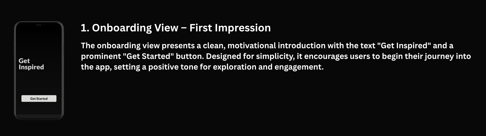
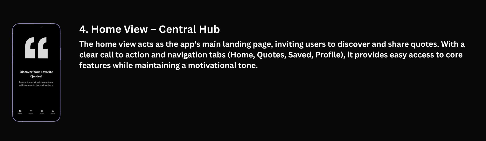
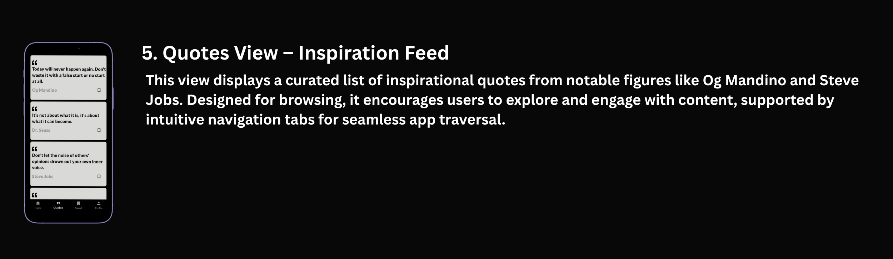
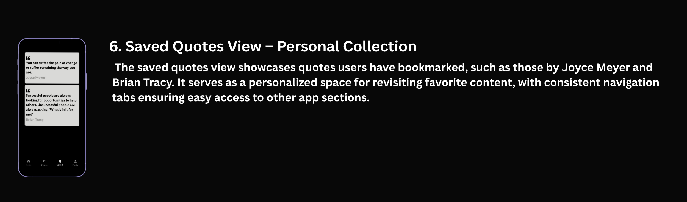
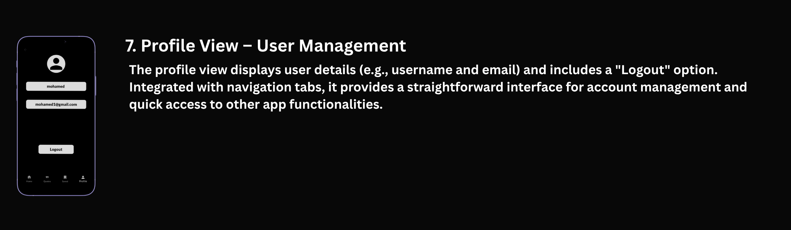

# Quotify 💬

🌟 Overview

- A motivational quotes app that delivers daily inspiration with a clean, minimalist interface. Users can browse, save, and revisit their saved quotes from renowned authors and thinkers.

<p align="center">
  
</p>

## ✨ Features
 🎨 Onboarding View
 - 🚀 "Get Inspired" tagline with a bold "Get Started" button.
 - ✨ Minimalist design for instant engagement.
<p align="center">
  
</p>

** 🔐 Authentication Flow

📲 Sign-In View:
- 📧 Email and password fields.
- ↩️ "Don’t have an account?" option.
<p align="center">
  
</p>

📝 Sign-Up View:
- 👤 Username, email, and password fields.
- ➡️ "Sign Up" button with "Sign In" redirect.
<p align="center">
  
</p>

🏠 Home View:
- 💬 Central hub with a "Discover Your Favorite Quotes!" header.
<p align="center">
  
</p>

📜 Quotes Feed:
- 🎯 Curated quotes from icons like Steve Jobs and Dr. Seuss.
- 🔄 Scrollable list for seamless browsing.
<p align="center">
  
</p>

💾 Saved Quotes:
- 💾 Bookmarked quotes (e.g., Joyce Meyer, Brian Tracy).
<p align="center">
  
</p>

👤 Profile View:
- 📛 User details (name, email).
- 🚪 Logout button.
<p align="center">
  
</p>

## 🛠️ Tech Stack

📱 Frontend
- Framework: Flutter.
- State Management: Bloc.

🌐 Backend
- API: [Rest API].
- Authentication: Firebase.
- Database: Hive (for saved quotes).


## 🏗️ Architecture
  - 🧩 MVVM pattern.
  - 📡 REST API integration.
  - 💽 Local storage (Hive).

```
lib/
│
├── core/
│   ├── utils/                        # App-wide utilities (router, styles, service locator, etc.)
│   ├── widgets/                      # Shared/reusable widgets (loading, error, etc.)
│   ├── errors/                       # Centralized management for app failures and edge cases.
│   └── functions/                    # Centralized management for app-wide helper functions.
│    
│
├── features/
│   ├── auth/
│   │   ├── data/                     # Models, repositories, data sources for authentication
│   │   │   ├── models/               # Auth-related data models (e.g., User, Credentials)
│   │   │   └── repos/                # Auth repository implementations
│   │   └── presentation/
│   │       ├── manager/              # Cubits, states for auth feature
│   │       ├── views/                # Auth views (sign in, sign up, etc.)
│   │       └── widgets/              # Auth-specific widgets (input fields, buttons)
│   │
│   ├── home/
│   │   ├── data/
│   │   │   ├── models/               # Models for home feature
│   │   │   └── repos/                # Home repository implementations
│   │   └── presentation/
│   │       ├── manager/              # Cubits, states for home feature
│   │       ├── views/                # Home view(s)
│   │       └── widgets/              # Home-specific widgets
│   │
│   ├── onboarding/
│   │   ├── data/
│   │   │   └── models/               # Models for onboarding (e.g., onboarding steps)
│   │   └── presentation/
│   │       ├── manager/              # Cubits, states for onboarding flow
│   │       ├── views/                # Onboarding view
│   │       └── widgets/              # Onboarding widgets
│   │
│   ├── quotes/
│   │   ├── data/                     # Models, repositories, data sources for quotes
│   │   │   ├── models/               # Quote data models
│   │   │   └── repos/                # Quotes repository implementations
│   │   └── presentation/
│   │       ├── manager/              # Cubits, states for quotes feature
│   │       ├── views/                # Quotes views
│   │       └── widgets/              # Quotes-specific widgets (quote item, etc.)
│   │
│   ├── saved_quotes/
│   │   ├── data/                     # Models, repositories for saved quotes
│   │   └── presentation/
│   │       ├── manager/              # Cubits, states for saved quotes
│   │       ├── views/                # Saved quotes view
│   │       └── widgets/              # Saved quotes widgets
│   │
│   ├── profile/
│   │   ├── data/                     # Models, repositories, services for user data/profile
│   │   └── presentation/
│   │       ├── manager/              # Cubits, states for user profile
│   │       ├── views/                # Profile view
│   │       └── widgets/              # Profile widgets (avatar, info, etc.)
│
└── main.dart                         # App entry point

assets/
└── images/                           # App image                   
└── fonts/                            # App fonts 
└── screen_shots/                     # screen shots 
```

  
**Key Points:**

- **core/**: Common utilities, local storage services, and shared widgets used across the app.
- **features/**: Each feature (Auth, Home, Onboarding, Quotes, Profile) is isolated with its own data and presentation layers.
- **data/**: Contains models and repository implementations for each feature.
- **presentation/manager/**: State management (Cubit/BLoC) for each feature.
- **presentation/views/**: views for each feature.
- **presentation/widgets/**: UI components and reusable widgets specific to each feature.
- **assets/**: Static resources such as images and icons.
- **main.dart**: App entry point.
---

**This structure is scalable, modular, and easy to maintain as your app grows.**


