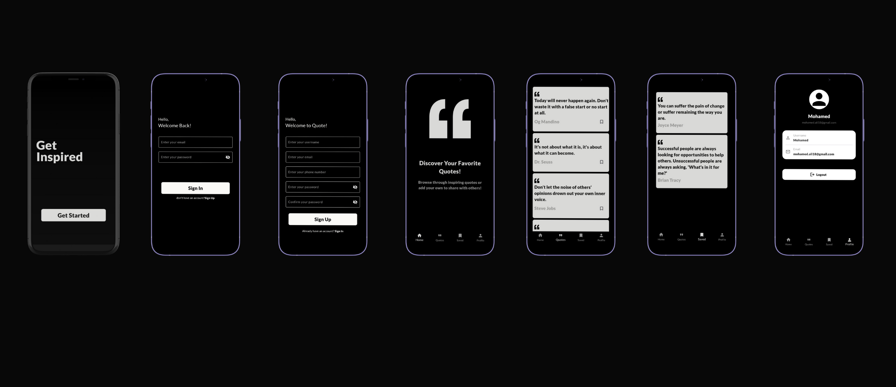
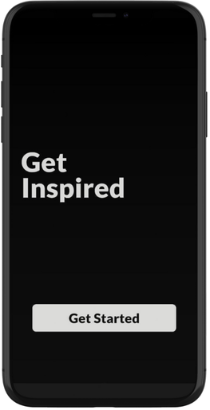
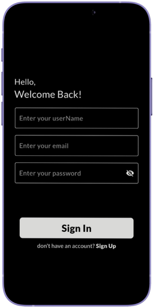
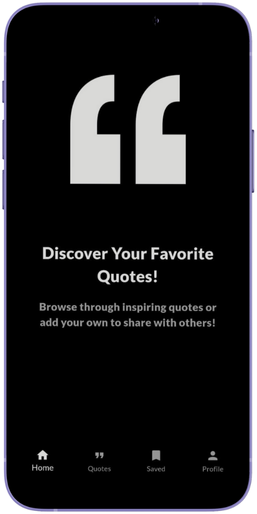
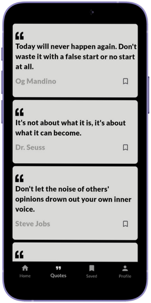
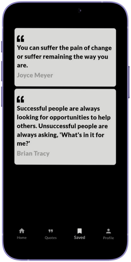
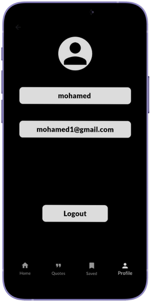

# Quotify 💬

🌟 Overview

- A motivational quotes app that delivers daily inspiration with a clean, minimalist interface. Users can browse, save, and revisit their saved quotes from renowned authors and thinkers.

<p align="center">
  
</p>

## 🎨 Views

🖼️ Onboarding View:
- Bold centered text: “Get Inspired”.
- Simple black background for a minimalist and elegant look.
- A “Get Started” button at the bottom navigates to the authentication flow.

<p align="left">
  
</p>

##

🔐 Sign In View:
- Greeting text: “Hello, Welcome Back!”.
- Three input fields: Username, Email, Password.
- “Sign In” button for logging in.
- Below it, a small text link: “Don’t have an account? Sign Up.” for navigation to registration.

<p align="left">
  
</p>

##

📝 Sign Up View:
- Greeting text: “Hello, Welcome to Quote!”.
- Three input fields: Username, Email, Password.
- “Sign Up” button to create an account.- Bottom has two buttons:
- A bottom text link: “Already have an account? Sign In.” to go back to login.
  
<p align="left">
  
</p>

##

🏠 Home View:
- Large centered quote icon and title:
- “Discover Your Favorite Quotes!”
- Subtitle: “Browse through inspiring quotes or add your own to share with others.”
 - Bottom navigation bar with icons for:
 - 🏠 Home / 💬 Quotes / 🔖 Saved / 👤 Profile


<p align="left">
  
</p>

##

💬 Quotes View:
- Scrollable list of quote cards.
- Each card contains:
- Quote text in quotation marks.
- Author name below (e.g., Dr. Seuss, Steve Jobs).
- A bookmark icon to save quotes.
 - Bottom navigation bar with icons for: Clean and structured for readability.


<p align="left">
  
</p>

##

🔖 Saved Quotes View:
- Displays user-saved quotes in the same card format as the Quotes view.
- Each card shows quote text, author.
- Same bottom navigation bar for consistency.


<p align="left">
  
</p>

##

👤 Profile View:
- Shows user avatar placeholder at the top.
- Displays username and email in separate cards or fields.
- Logout button below for signing out.
- Minimal black-and-white design maintaining the app’s theme.


<p align="left">
  
</p>

## 🛠️ Tech Stack

📱 Frontend
- Framework: Flutter.
- State Management: Bloc.

🌐 Backend
- API: [Rest API].
- Database: Hive (for saved quotes).


## 🏗️ Architecture
  - 🧩 MVVM pattern.
  - 📡 REST API integration.
  - 💽 Local storage (Hive, Shared Prefrences).

```
lib/
│
├── core/
│   ├── utils/                        # App-wide utilities (router, styles, service locator, etc.)
│   ├── widgets/                      # Shared/reusable widgets (loading, error, etc.)
│   ├── errors/                       # Centralized management for app failures and edge cases.
│   └── functions/                    # Centralized management for app-wide helper functions.
│    
│
├── features/
│   ├── auth/
│   │   ├── data/                     # Models, repositories, data sources for authentication
│   │   │   ├── models/               # Auth-related data models (e.g., User, Credentials)
│   │   │   └── repos/                # Auth repository implementations
│   │   └── presentation/
│   │       ├── manager/              # Cubits, states for auth feature
│   │       ├── views/                # Auth views (sign in, sign up, etc.)
│   │       └── widgets/              # Auth-specific widgets (input fields, buttons)
│   │
│   ├── home/
│   │   ├── data/
│   │   │   ├── models/               # Models for home feature
│   │   │   └── repos/                # Home repository implementations
│   │   └── presentation/
│   │       ├── manager/              # Cubits, states for home feature
│   │       ├── views/                # Home view(s)
│   │       └── widgets/              # Home-specific widgets
│   │
│   ├── onboarding/
│   │   ├── data/
│   │   │   └── models/               # Models for onboarding (e.g., onboarding steps)
│   │   └── presentation/
│   │       ├── manager/              # Cubits, states for onboarding flow
│   │       ├── views/                # Onboarding view
│   │       └── widgets/              # Onboarding widgets
│   │
│   ├── quotes/
│   │   ├── data/                     # Models, repositories, data sources for quotes
│   │   │   ├── models/               # Quote data models
│   │   │   └── repos/                # Quotes repository implementations
│   │   └── presentation/
│   │       ├── manager/              # Cubits, states for quotes feature
│   │       ├── views/                # Quotes views
│   │       └── widgets/              # Quotes-specific widgets (quote item, etc.)
│   │
│   ├── saved_quotes/
│   │   ├── data/                     # Models, repositories for saved quotes
│   │   └── presentation/
│   │       ├── manager/              # Cubits, states for saved quotes
│   │       ├── views/                # Saved quotes view
│   │       └── widgets/              # Saved quotes widgets
│   │
│   ├── profile/
│   │   ├── data/                     # Models, repositories, services for user data/profile
│   │   └── presentation/
│   │       ├── manager/              # Cubits, states for user profile
│   │       ├── views/                # Profile view
│   │       └── widgets/              # Profile widgets (avatar, info, etc.)
│
└── main.dart                         # App entry point

assets/
└── images/                           # App image                   
└── fonts/                            # App fonts 
└── screen_shots/                     # screen shots 
```

  
**Key Points:**

- **core/**: Common utilities, local storage services, and shared widgets used across the app.
- **features/**: Each feature (Auth, Home, Onboarding, Quotes, Profile) is isolated with its own data and presentation layers.
- **data/**: Contains models and repository implementations for each feature.
- **presentation/manager/**: State management (Cubit/BLoC) for each feature.
- **presentation/views/**: views for each feature.
- **presentation/widgets/**: UI components and reusable widgets specific to each feature.
- **assets/**: Static resources such as images and icons.
- **main.dart**: App entry point.
---

**This structure is scalable, modular, and easy to maintain as your app grows.**


